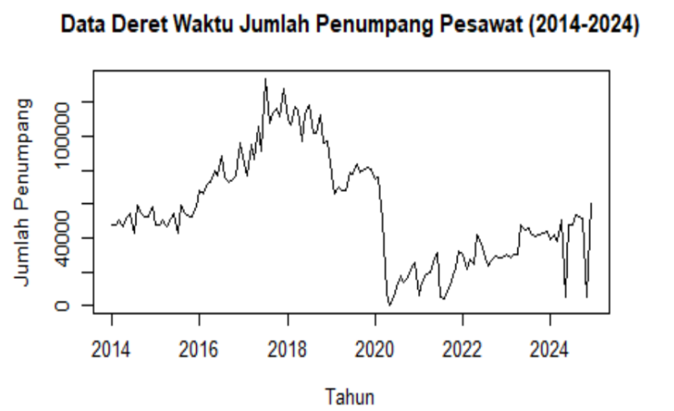
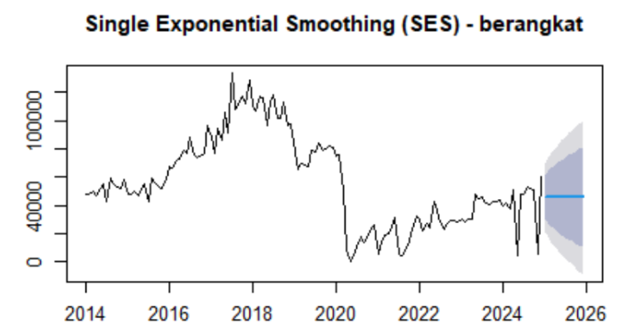
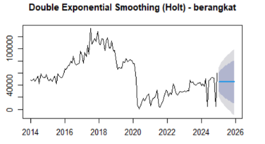

# ✈️ Airline Passenger Forecasting Using Exponential Smoothing

Forecasting monthly airline passenger departures using **Single Exponential Smoothing (SES)** and **Double Exponential Smoothing (Holt)** to compare forecasting performance and identify the most representative model for time series data with trend characteristics.

---

## 📌 Project Overview

Forecasting passenger demand is essential for airlines and airport operators to optimize operational planning, resource allocation, and service capacity.

This project analyzes monthly airline passenger departures in Indonesia from **2014–2024** using two time series forecasting approaches:

- Single Exponential Smoothing (SES)
- Double Exponential Smoothing (Holt)

The objective is to compare both methods and determine which model better represents the historical data patterns.

---

## 🎯 Objectives

- Analyze historical airline passenger trends.
- Develop forecasting models using SES and Holt's DES.
- Compare forecasting performance using multiple evaluation metrics.
- Generate passenger forecasts for the following 12 months.
- Provide insights for operational planning and decision-making.

---

## 📂 Dataset

**Source**

- Badan Pusat Statistik (BPS) Indonesia

**Period**

- January 2014 – December 2024

**Frequency**

- Monthly

**Observations**

- 132 Records

---

## 🛠 Tech Stack

- R
- forecast
- ggplot2
- readr
- dplyr

---

## 🔄 Project Workflow

```text
Dataset
   │
   ▼
Data Cleaning
   │
   ▼
Exploratory Time Series Analysis
   │
   ▼
Single Exponential Smoothing (SES)
   │
   ▼
Double Exponential Smoothing (Holt)
   │
   ▼
Forecasting
   │
   ▼
Model Evaluation
   │
   ▼
Insights
```

---

# 📈 Time Series Visualization



The historical data shows:

- Increasing passenger trend before 2020
- Significant decline during the COVID-19 pandemic
- Gradual recovery after 2022
- High fluctuation requiring suitable forecasting models

---

# 📊 Forecasting Models

## Single Exponential Smoothing (SES)



Characteristics:

- Suitable for stable data
- Produces constant forecasts
- Does not capture trend

---

## Double Exponential Smoothing (Holt)



Characteristics:

- Captures trend component
- Produces adaptive forecasts
- Better represents changing data patterns

---

# 📉 Model Performance

| Metric | SES | DES (Holt) |
|---------|------------:|------------:|
| MSE | 148,444,051 | 148,467,645 |
| RMSE | 12,183.77 | 12,184.73 |
| MAPE | 73.95% | **73.89%** |

Although SES produced slightly lower MSE and RMSE values, Holt's DES achieved the lowest MAPE and better captured the underlying trend.

---

# 💡 Key Insights

- Passenger demand experienced significant fluctuations during 2014–2024.
- COVID-19 created a structural break in the historical series.
- Passenger numbers gradually recovered after 2022.
- SES generated constant forecasts throughout 2025.
- Holt's DES produced more dynamic forecasts by incorporating trend.
- DES is considered more representative for this dataset.

---

# 👨‍💻 My Contributions

As a member of this project, I contributed to:

- Data collection
- Data preprocessing
- Time series analysis
- Forecasting model implementation
- Performance evaluation
- Result interpretation
- Report preparation

---

# 📁 Repository Structure

```text
airline-passenger-forecasting/
│
├── README.md
├── LICENSE
│
├── data/
│   └── jumlah_penumpang.csv
│
├── scripts/
│   └── forecasting.R
│
├── reports/
│   ├── Final Report.pdf
│   └── LinkedIn Carousel.pdf
│
├── dashboard/
│   └── Forecast Dashboard.pdf
│
└── images/
    ├── cover.png
    ├── time-series-plot.png
    ├── ses-forecast.png
    ├── des-forecast.png
    ├── comparison.png
    ├── evaluation.png
    ├── workflow.png
    └── github-qr.png
```

---

# 📄 Report

The complete project report is available in:

```
reports/Final Report.pdf
```

---

# 📬 Contact

**Khoirul Muttoharoh**

- 💼 LinkedIn: https://linkedin.com/in/khoirul-muttoharoh-057a54277
- 📧 Email: khoirul.123450021@student.itera.ac.id

---

⭐ If you find this project useful, feel free to give it a star.
